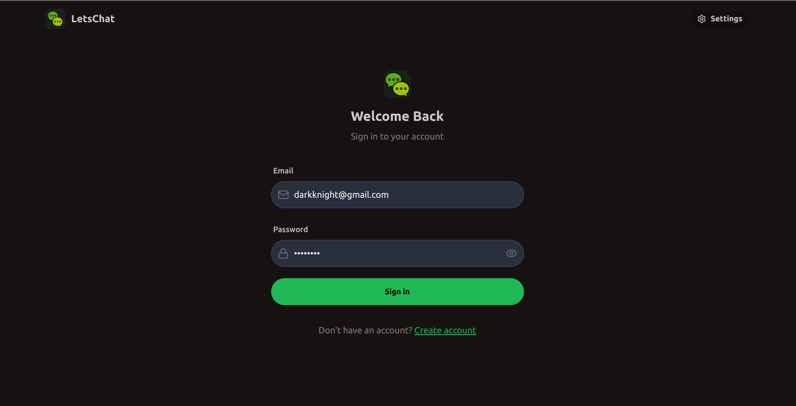
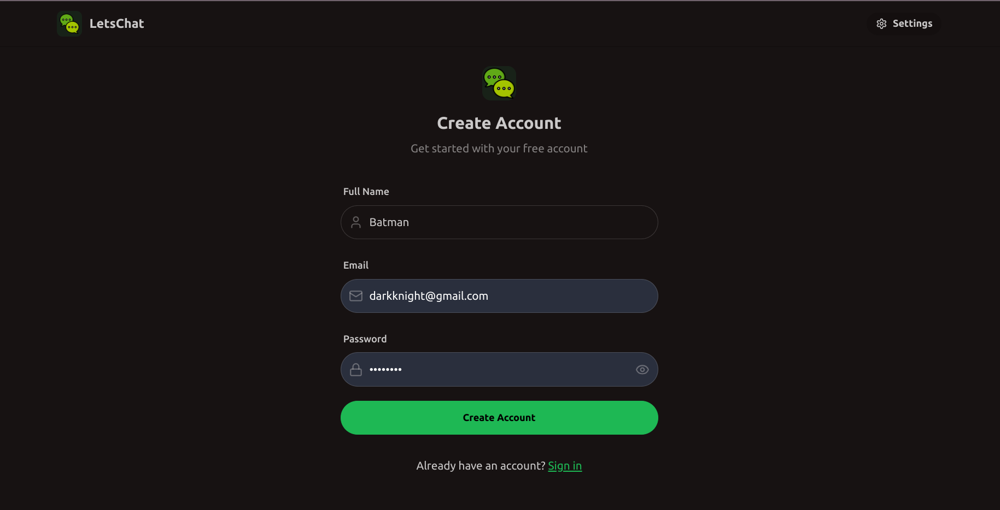
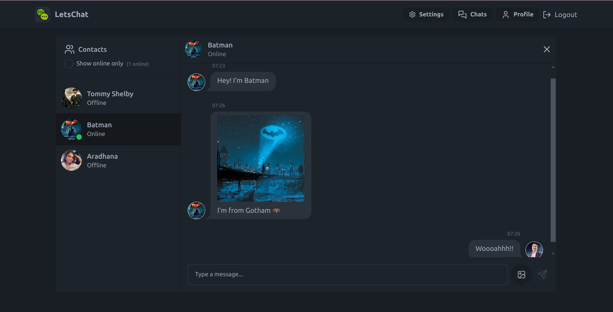
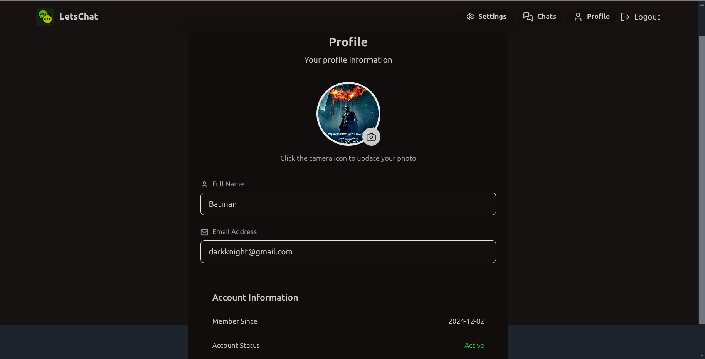
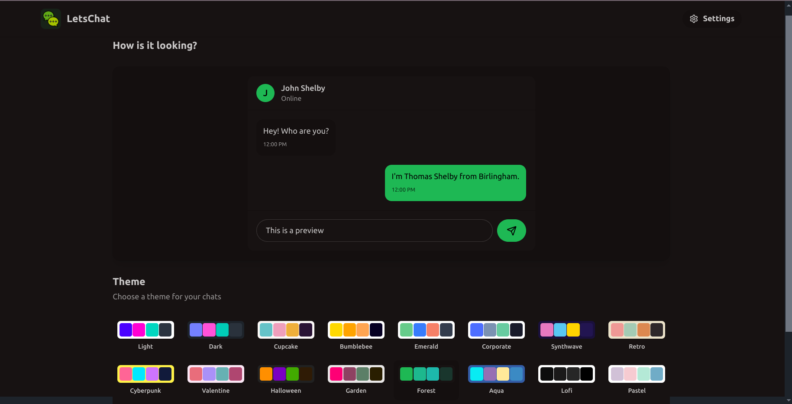

# LetsChat

LetsChat is a real-time chat application designed to facilitate seamless communication. It leverages modern web technologies to deliver a fast and responsive user experience.

## Tech Stack

### Backend:

-   **Node.js** with **Express.js**
-   **MongoDB** with **Mongoose** ORM
-   **Socket.io** for real-time communication
-   **Cloudinary** for media storage
-   **dotenv** for environment variable management

### Frontend:

-   **React.js** for building the user interface
-   **Vite** for fast development and bundling
-   **Tailwind CSS** and **DaisyUI** for styling
-   **Axios** for HTTP requests
-   **Zustand** for state management
-   **React Router** for routing

## Features

-   Real-time messaging with WebSockets (Socket.io)
-   User authentication and authorization
-   Media upload functionality with Cloudinary
-   Responsive and interactive UI with React and Tailwind CSS
-   Environment-specific configuration using dotenv

## Project Setup

### Backend:

1. Navigate to the backend folder:
    ```bash
    cd backend
    ```
2. Install dependencies:
    ```bash
    npm install
    ```
3. Create a `.env` file in the `backend` directory and add the following secrets:

    ```dotenv
    MONGO_URI="mongodb+srv://<username>:<password>@cluster0.iwv13.mongodb.net/LetsChat?retryWrites=true&w=majority&appName=Cluster0"
    PORT=5001
    JWT_SECRET="YourJWTSecret"
    NODE_ENV="development"
    CLOUDINARY_CLOUD_NAME="YourCloudinaryCloudName"
    CLOUDINARY_API_KEY="YourCloudinaryAPIKey"
    CLOUDINARY_API_SECRET="YourCloudinaryAPISecret"
    ```

4. Replace `<username>`, `<password>`, and other placeholders with your own values. Keep these credentials secure!

5. Run the backend server:
    ```bash
    npm run dev
    ```

### Frontend:

1. Navigate to the client folder:
    ```bash
    cd client
    ```
2. Install dependencies:
    ```bash
    npm install
    ```
3. Create a `.env` file in the `client` directory and add the following environment variables:

    ```dotenv
    # For development mode
    VITE_API_URL=http://localhost:5001/api

    # For production mode
    VITE_API_URL=/api
    ```

4. Start the development server:
    ```bash
    npm run dev
    ```

## Scripts

### Backend:

-   `npm run dev`: Starts the backend server with nodemon.

### Frontend:

-   `npm run dev`: Starts the frontend development server with Vite.
-   `npm run build`: Builds the production-ready frontend.
-   `npm run preview`: Previews the built project.

## Screenshot

Login


Signup


Chats


Profile


Settings


## Contributing

Contributions are welcome! Please fork the repository and submit a pull request.

## License

This project is licensed under the ISC License.

## Author

**Aman Dubey**

---

**Happy Chatting!** 🚀
